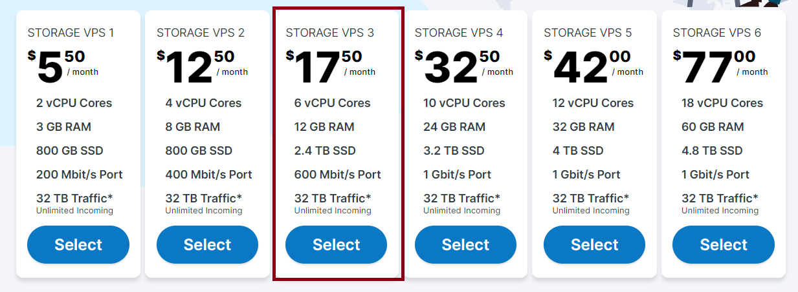
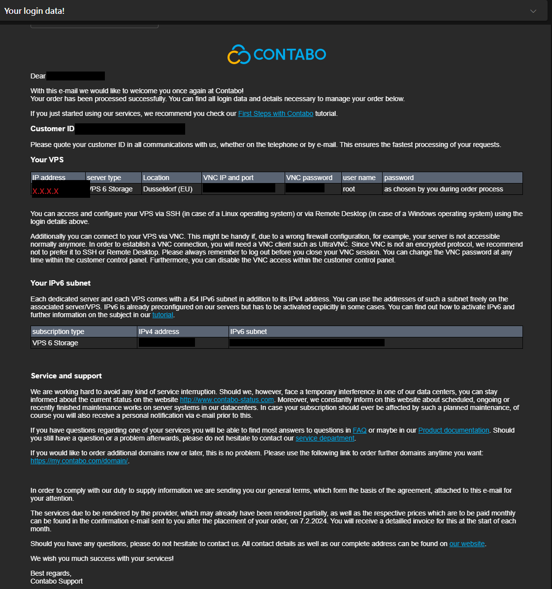

## NodeBeginner

這是一個提供給區塊鏈應用節點架設兼營運的 Linux 初學者教學，讓人人都能以低學習／金錢成本管理自己的節點。
本篇面向非資訊／計算機相關背景，盡量不提到代碼，以命令為主。並以 Contabo 的 VPS 示範。

### 目錄

1. [雲端服務](#1-雲端服務)
2. [選擇機器](#2-選擇機器)
3. [更新機器](#3-更新機器)
4. [硬體監控](#4-硬體監控)
5. [資安設定](#5-資安設定)
6. [硬碟監控](#6-硬碟監控)
7. [流量監控](#7-流量監控)
8. [常用命令](#8-常用命令)
9. [節點容器](#9-節點容器)
10. [贊助](#10-贊助)

### 1. 雲端服務

**首先說明為何一般人需要雲端供應商的服務來運行節點：**

**如果你有自己的機房可以跳過這邊，而且你應該也不需要看這篇了。**

運行區塊鏈節點特別是有獎勵的驗證者節點在硬體之外有個很重要的要求，那就是網路品質，家用網路一般難以維持 24h 不斷線且高頻寬的狀態，因為家庭網路大多不是專線。也因此撇除硬體的部分，我們很需要雲端供應商提供的網路品質來讓我們的節點維持不斷運行。網路品質一差輕則沒獎勵；重則被扣錢。

常見的雲端供應商即便是初學者大概都知道幾個，首先是三大廠：

- [AWS](https://aws.amazon.com/)
- [Azure](https://azure.microsoft.com/)
- [GCP](https://console.cloud.google.com/)

再來是一些稍微小型的雲端供應商：

- [Contabo](https://contabo.com/)
- [Digital Ocean](https://www.digitalocean.com/)
- [Vultr](https://www.vultr.com/?ref=9591395-8H)

我們這邊選擇德國大廠 Contabo 進行教學，原因是因為歐洲廠的雲端相較美國廠的便宜非常非常多。
以 Contabo 為例，優點就是便宜且效率不差，缺點就是機器選擇較少、延遲稍高、客服回覆較慢，還有這家的維護伺服器時間較長（約 45 分鐘），但個人是沒遇過維護。另外德國廠商以嚴謹著名，有很高的機率需要 KYC，不過這間的 KYC 很鬆，只要提交把機密資訊稍微馬賽克的護照就行，據說沒英文的身分證也行。
另外由於服務便宜的原因，這家不像其他大廠直接提供控制面板、防火牆等功能，需要另外付費，下面的教學會提供伺服器的基礎設定教學，替你省去不必要的費用。
※當然你也可以選擇其他歐洲大廠，但都差不多需要高度的自託管，而且品質不一定好。

### 2. 選擇機器

首先請把鼠標移到右上角語言貨幣的地方，將 Currency 改成 EUR，會比較省。

再來先確認想運行的節點硬體要求，這邊以 [以太坊驗證者節點](https://ethereum.org/developers/docs/nodes-and-clients/run-a-node) 為例：

```
Minimum requirements
CPU with 2+ cores
8 GB RAM
2TB SSD
10+ MBit/s bandwidth

Recommended specifications
Fast CPU with 4+ cores
16 GB+ RAM
Fast SSD with 2+TB
25+ MBit/s bandwidth
```

根據上面的建議，這邊選擇了 **STORAGE VPS 3**

**※ 由於 Contabo 的機器選擇較少，儲存空間要求較高的節點可以選擇 STORAGE VPS，省去多餘的 CPU 與 Memory 花費。**



點擊 Select 以後會發現選項相較其他雲端並不多，我們只需要選擇幾項就好：

1. Select your term length：這個選項可以選擇你喜歡的收費週期，越大的收費週期設置費越低，不過設置費只收一次。
2. Region：運行節點的話一般是不選擇這個的，因為無所謂，你想要的話可以改，但會被多收地區維護費用。除非你要架設 VPN，不然沒必要更動。
3. Image：如果節點要求沒有寫，建議選擇 Ubuntu 22.04。
   - Storage Type：如果你選擇的是 VPS 會看到這個選項，一般選 SSD 即可，NVME 是更快但更貴的硬碟。
4. Login & password for your server：這個建議使用密碼生成器，推薦使用 [1password](https://1password.com/) 紀錄密碼。

都設定好就能直接點 Next 到下個頁面，確認訂購資訊沒問題就可以 Order & Pay。

**※再次提醒，先把支付貨幣改為 EUR，比較省錢。只要購買了第一個服務，要改就需要創新帳號後，申請轉移服務了。**

再來就等信寄來，你『有可能』會收到 KYC 請求信：

```
Dear Sir or Madam,

...

First of all, we would kindly ask you to send us the following information:

First Name:
Last Name:
Address:
City:
ZIP Code:
Country:
Telephone Number:

...
```

直接以英文回覆郵件你的這些資訊並附上把重要資訊打碼的護照或身分證即可，建議使用護照。

再來通過驗證後就會收到以下的登入資訊：



### 3. 更新機器

拿到使用權後，
Windows 用戶可以在開始那邊搜尋 Windows PowerShell，運行它：
MacOS 用戶可以直接打開終端機：

輸入以下指令登入遠端主機確認硬體資訊是否符合：

```sh
# x.x.x.x 請換成主機的 ip 位址
ssh root@x.x.x.x

# 之後變更 ssh port 之後，改為使用以下方式
ssh -p <port 號> root@x.x.x.x
```

會看到以下的內容：

```sh
Welcome to Ubuntu 22.04.3 LTS (GNU/Linux 5.15.0-25-generic x86_64)

 * Documentation:  https://help.ubuntu.com
 * Management:     https://landscape.canonical.com
 * Support:        https://ubuntu.com/pro
  _____
 / ___/___  _  _ _____ _   ___  ___
| |   / _ \| \| |_   _/ \ | _ )/ _ \
| |__| (_) | .` | | |/ _ \| _ \ (_) |
 \____\___/|_|\_| |_/_/ \_|___/\___/

Welcome!

This server is hosted by Contabo. If you have any questions or need help,
please don't hesitate to contact us at support@contabo.com.
```

輸入以下指令讓伺服器的套件維持在最新狀態：

```sh
apt update -y
apt upgrade -y
```

### 4. 硬體監控

確認硬體資訊有無錯誤，分別輸入以下 3 條指令確認下方的硬體資訊：
※以下會看到很多 TiB, GiB, MiB 等等的單位，新手可以直接乘以 1.1 即代表 TB, GB, MB

```sh
lshw -C cpu
lshw -C memory
lshw -C disk
```

檢查 CPU, Memory 和 Disk 的部分是否與訂購的相同（本文配置 8vCPU, 24 GB RAM, 1.2 TB SSD）：

```sh
# *-cpu 之下，檢查 enabledcores = 8 * thread = 1 代表 vCPU = 8 * 1 = 8
configuration: cores=8 enabledcores=8 microcode=137367674 threads=1

# *-memory 之下，檢查 size 等於多少 GiB
description: System Memory
...
size: 24GiB
...

#  *-disk 之下，檢查 System Memory 的 size 等於多少 GiB（除以 1000 就約等於 TB）
size: 1200GiB (1288GB)
```

確認都符合就可以進行下一步啦~

### 5. 資安設定

來到最重要的環節了，因為自託管伺服器是沒有防火牆跟控制面板的，這會讓你的伺服器很容易被一鍋端了，我們需要進行一些基本的防護措施。

**※因為我們運行節點的主機一般只有個人使用，可以直接使用 root，不必建立其他用戶帳號，介意的人可以自行建立。**

1. 修改 root 密碼，輸入以下指令後輸入新密碼與確認密碼（輸入後介面不會顯示密碼是正常的，輸入完按 Enter 即可）：

   ```sh
   passwd
   ```

2. 修改 ssh 預設 Port 號，輸入以下指令：

   ```ssh
   nano /etc/ssh/sshd_config
   ```

   然後用方向鍵向下移動到 `#Port 22` 這行，將 #Port 22 的井字號刪掉，22 改成你喜歡的數字（介於 10000 到 65535 之間）而且要記起來。
   之後按下 ctrl + x，再按 y，再按 Enter 或 Return。
   ※這邊假設改成了 12345，後續會用到。

3. 開啟防火牆，輸入以下指令：

   ```sh
   ufw default deny
   ufw allow 12345 # 允許你的 ssh 流量進入伺服器
   ufw allow ... # 允許你想開放的 port，可以去查看節點要求使用哪些 port ，開放那些 port 就好
   # 如果你想開放 http/https 可以使用 ufw allow http, ufw allow https

   ufw status numbered # 確認目前開放了哪些 port

   ufw enable # 啟用防火牆

   ufw status # 確認防火牆是否運行
   ```

這樣就完成了基本的伺服器防護了。

### 6. 硬碟監控

運行節點需要的硬碟空間很大，一般都是用來放置區塊鏈資訊的不能刪，你能做的只有擴充空間或是刪除紀錄檔，建議一開始硬碟就挑大一點，加硬碟都不便宜。這邊只提供怎麼查看硬碟使用容量的方式：

```sh
lsblk # 查看整顆硬碟還有分區的容量
df -h # 查看伺服器上各磁碟分區的使用量
```

### 7. 流量監控

運行驗證者節點需要的流量也很大，因為隨時在與區塊鏈網路溝通，但這部分比較不需在意，因為 Contabo 提供的流量上限挺高的，並且超出流量上限僅會降速，最低也有 100 Mbps。這邊提供監控流量的方式：

```sh
apt install vnstat # 安裝輕量的流量監控工具

vnstat # 查看今天與本月流量
vnstat -m # 查看本月流量

man vnstat # 查看其餘可選參數
```

```sh
# 以下為結果範例，rx 代表接收的流量，tx 代表發送的流量。
# 以 Contabo 為例，rx 沒有上限，tx 每個月的上限以我的方案來說是 32 TB 約 29 TiB，因此只要我每月不超出 29 TiB 的發送流量
# ，就不會被降速。

eth0  /  monthly

       month        rx      |     tx      |    total    |   avg. rate
    ------------------------+-------------+-------------+---------------
      2024-02    313.79 MiB |  114.34 MiB |  428.13 MiB |    2.57 kbit/s
    ------------------------+-------------+-------------+---------------
    estimated    561.54 MiB |  203.11 MiB |  764.65 MiB |
```

### 8. 常用命令

這邊提供初學者一些架設節點常用的基礎命令：

```sh
cd # 切換到家目錄，cd .. 回到上一層目錄，cd <path> 切換到指令路徑
ls -la # 列出當前目錄下的所有檔案，ls -la <path> 列出指定路徑下的所有檔案
mv # 移動檔案／目錄，使用 mv ./xxx.png ./yyy.png 可以達到重新命名的效果
mkdir # 建立資料夾
rm # 刪除檔案，刪除整個資料夾請用 rm -r
```

其餘命令對於節點架設大多沒必要，有需要再查詢就好。

### 9. 節點容器

容器化初學者可以簡單想像就是幫你打包好的黑盒子，只要一鍵就能完成節點架設。
這邊考慮讀者不一定有開發經驗，因會影響防火牆，僅稍微提一下。
對於初學者來說使用 docker 架設節點可以省去非常非常多功夫加上 docker compose 提供崩潰自啟動的功能，非常適合運行不能斷線的節點。
如果用戶看到節點文件提供以 docker compose 運行的方式，可以查看 `docker-compose.yml`，內容假設是以下的樣子：

```yml
services:
  web:
    build: .
    ports:
      - "12345:8000"
  db:
    image: postgres
    ports:
      - "22345:5432"
```

這代表了你對外開放的 Port 是 12345 和 22345，那麼你的防火牆必須加上這些 Port：

**※變更對外開放的 Port 一般情況下是可以的，但區塊鏈節點不同，很可能網路已經設定好了就是要這些 Port。**

```sh
ufw allow 12345
ufw allow 22345
ufw enable # 套用新規則後啟動防火牆
```

### 10. 贊助

如果你覺得這篇教學對你有幫助，可以替這個倉庫按下星星，也歡迎詢問更進一步的問題。
有餘力也可以考慮贊助我，非常感謝！

<div class="flex">
  <a href="https://etherscan.io/address/0x03762c4478518fbf036ed6062fe9035d2e6d0670"></a>
  <a href="https://solscan.io/account/55r7FvKkcddtgSDfGLKuLwjgJ5o5QiKpopWK7GMgwE2A"></a>
</div>
